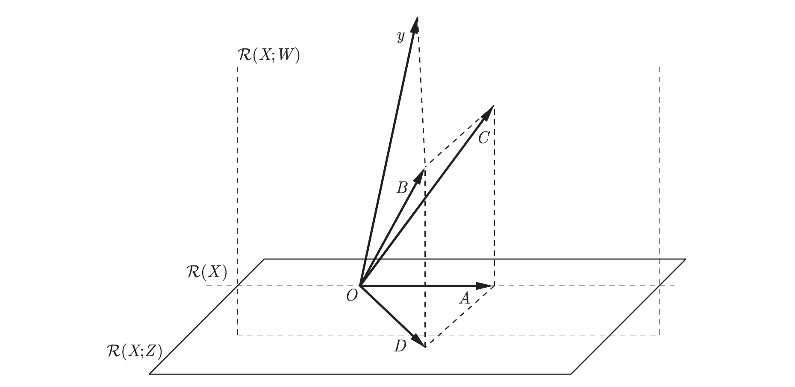
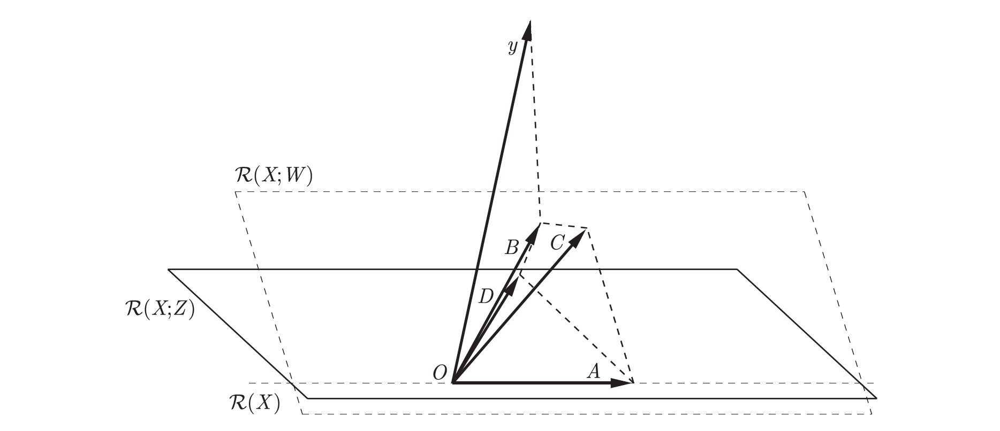

## Słów przypomnijmy sobie interakcje

Na danych symulacyjnych łatwiej zauważyć pewne efekty.

```{r warning=FALSE, message=FALSE}
library(PBImisc)
library(MASS)
cancers <- rep(c("Breast", "Ovarian", "Lung"), each=10)
treatments <- rep(c("Chemo", "Radio", "Mixed"), each=10)
df <- merge(cancers, treatments)
df$z <- rnorm(nrow(df)) + ifelse(df$x == "Breast" & df$y == "Radio", 3, 0)
df$xy <- paste(df$x, df$y)
```

Modelowanie zaczynamy od graficznej inspekcji.

```{r warning=FALSE, message=FALSE}
library(ggplot2)
ggplot(df, aes(xy, z)) +geom_boxplot() + coord_flip()
colnames(df) <- c("cancers", "treatments", "z")

plot.design(z~cancers+treatments, data=df)

interaction.plot(df$cancers, df$treatments, df$z)

interaction.plot(df$treatments, df$cancers, df$z)
```

Seria testów F I i III rodzaju.

```{r warning=FALSE, message=FALSE}
model0 <- lm(z~1, data=df)
modelC <- lm(z~cancers, data=df)
modelCT <- lm(z~cancers+treatments, data=df)
modelCTi <- lm(z~cancers*treatments, data=df)

anova(modelC)
anova(modelC, model0)
anova(modelCT)
anova(modelCT, model0)
anova(modelCTi)
anova(modelCTi, modelCT)
anova(modelCTi, modelC)
summary(modelCTi)

```

## Bądź ostrożny gdy testujesz

Bądź przygotowany na niespodzianki.

```{r}
head(YXZ)

# typ III - marginal
summary(lm(Y~X+Z, data=YXZ))

# type I - sequential
anova(lm(Y~X+Z, data=YXZ))
anova(lm(Y~Z+X, data=YXZ))

# Niespodzianka
anova(lm(Y~X, data=YXZ))
anova(lm(Y~Z, data=YXZ))
```






## Analiza hierarchiczna


```{r}
library(PBImisc)
head(apartments[,c(1,2,5,6,7,10,14)])

anova(lm(m2.price ~ factor(year)+factor(month), data=apartments))
anova(lm(m2.price ~ factor(year)/factor(month), data=apartments))
anova(lm(m2.price ~ factor(year)*factor(month), data=apartments))

anova(lm(m2.price ~ factor(district)+factor(street), data=apartments))
anova(lm(m2.price ~ factor(district)/factor(street), data=apartments))
anova(lm(m2.price ~ factor(district)*factor(street), data=apartments))

```


## Praca domowa

Znajdź przykładowe dane na których można wykonać analizę dwukierunkową crossed i nested (mogą być to różne zbiory danych). 

Możesz korzystać z dowolnych danych dostępnych już w R lub wczytanych do R z innego źródła, ale nie możesz korzystać z danych które zgłosiła wcześniej inna osoba (liczy się czas pull request).

## ANCOVA

Jeżeli wystarczy czasu

```{r}
library(PBImisc)
summary(endometriosis)

library(lattice)
xyplot(log(alpha.factor)~log(beta.factor)|disease*phase, data= endometriosis, type=c("p","r"))

xyplot(log(alpha.factor)~log(beta.factor)|phase, data= endometriosis, type=c("p","r"))

library(nlme)
CF = factor(paste(endometriosis$disease,endometriosis$phase))
nlme::lmList(log(alpha.factor)~log(beta.factor)|CF, data=endometriosis)

summary(modelF <- aov(log(alpha.factor)~log(beta.factor)*phase, data=
endometriosis))

```


