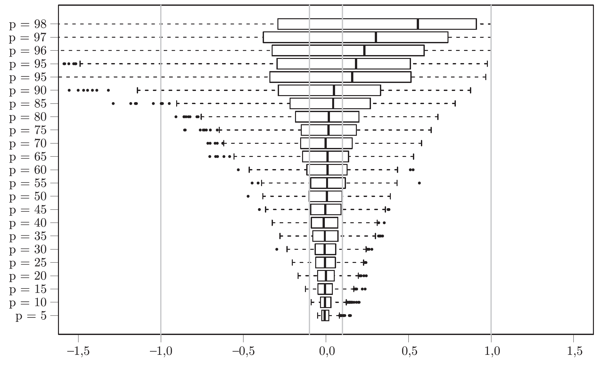

Na podstawie rozdziału 2.6

# Kryteria i błędy

!!! Błędy typu I i II - klasyka.

!!! Błędy typu M i S podane przez Andrew Gelman.

Kryteria wyboru modelu:

* GIC
* R^2
* Adjusted R^2
* Cp Mallowsa
* Walidacja krzyżowa

## Przykład zabawka

Związek stężenia elastazy a pracą nerki (GFR). 
Mamy dane o sprawności przeszczepionej nerki dla 54 pacjentów. 

Interesuje nas określenie, które zmienne (wiek, płeć, waga, elastaza) mają związek z GFR.

```{r warning=FALSE, message=FALSE}
library(PBImisc)
library(car)

head(elastase)

summary(lm(GFR~weight+poly(elastase,3), data=elastase))
```

## Przykład symulacyjny

```{r warning=FALSE, message=FALSE}
 set.seed(4)
 y = rnorm(100)
 X = matrix(rnorm(9800),100,98)
 summary(lm(y~X))


 set.seed(1313)
 y = rnorm(100)
 X = matrix(rnorm(9800),100,98)
 # summary(lm(y~X))
```

Rozkład adjusted R^2 dla rosnącego p.



# Współliniowość zmiennych

```{r}
 vif(lm(GFR~., data=elastase))
```

Testy typu I i III, brzegowe i sekwencyjne.

```{r}
 summary(model.el.1 <- lm(GFR~., data=elastase))

 summary(model.el.2 <- lm(GFR~weight+elastase, data=elastase))

 anova(model.el.2, model.el.1)
```
 
Funkcja krokowego wyboru modelu.
 
```{r}
 model.el.3 = step(model.el.1)
 summary(model.el.2)
```


## Większy przykład

Usuwamy wiersze z brakami w danych i dodajemy zmienne pozwalające na konstrukcję krzywej sklejanej na podstawie roku budowy


```{r}
 apartments2 = na.omit(apartments[,c(13,1,3,5,7,8,9,10,14,15,16)])
 apartments2$construction1990 = apartments2$construction.date - 1990
 apartments2$starszy1990 = apartments2$construction.date > 1990
```

Dodajemy informację o odległości od centrum

```{r}
 centrumWsp = apartments2[apartments2$district=="Srodmiescie",10:11][1,]
 dzielnice = levels(apartments2$district)
 
 getDistKm <- function(x, y) {
   sqrt(sum(((x-y)*c(100,70))^2))
 }
 
 odl = sapply(dzielnice, function(x)
      getDistKm(centrumWsp, apartments2[apartments2$district == x, 10:11][1,]))
 apartments2$odleglosc = odl[apartments2$district]
 head(apartments2)
```

Lista kandydujących zmiennych objaśniających, w modelowaniu prawdziwych danych często rozpatruje się wtórne zmienne wyznaczone jako przekształcenia wielomianowe lub interakcje zmiennych oryginalnych.

```{r}
 zm = c("factor(year)", "surface", "poly(surface,3)", "district", "n.rooms ", "floor", "type", "construction1990", "construction1990:starszy1990", "odleglosc", "poly(odleglosc,3)", "district:factor(year)", "district:type", "district:condition", "district:surface")

 # indeksy wszystkich podzbiorów indeksowego zbioru length(zm)
 library(e1071)
 wsp = (bincombinations(length(zm))==1)[-1,]
 params = matrix(0, nrow(wsp), 4)
 for (i in 1:nrow(wsp)) {
     form = as.formula(paste("m2.price~", paste(zm[wsp[i,]], collapse="+")))
     model = lm(form, data=apartments2)
     params[i,1] = AIC(model, k=log(nrow(apartments2)))
     params[i,2] = model$rank
     params[i,3] = summary(model)$adj.r.squared
     params[i,4] = AIC(model)
 }

# model optymalny w sensie kryterium AIC (p = 80)
as.formula(paste("m2.price~",paste(zm[wsp[which.min(params[,4]),]], collapse="+")))
```

Jak to wygląda na wykresie?

```{r}
library(ggplot2)
params <- as.data.frame(params)
colnames(params) <- c("BIC", "rank", "adjR2", "AIC")
ggplot(params, aes(rank, BIC)) +
  geom_point(size=1) +
  geom_point(data=params[which.min(params$BIC),], color="red", size=3)

ggplot(params, aes(rank, AIC)) +
  geom_point(size=1) +
  geom_point(data=params[which.min(params$AIC),], color="red", size=3)
  
```

## A teraz dane skorelowane

Rodowód BC i muszki owocowe.


```{r}
 attach(Drosophila)
 chr
 pos
 head(bs)
 korr = cor(model.matrix(pc1~., data=bs[,1:42])[,-1])
 korr[1:6,1:6]

 heatmap(1-abs(korr),symm=T,Rowv=NA,Colv=NA)
 # współczynnik współliniowości kolumn
 library(car)
 vif(lm(pc1~., data=(dat<-bs[,1:42])))
```
 
Model jednowymiarowy
 
```{r}
 library(lattice)
 pval = numeric(41)
 for (i in 1:41) {
     pval[i] = summary(aov(bs$pc1 ~ bs[,i]))[[1]][1,5]
 }
 xyplot(-log(pval)~pos|chr, type=c("p","l"), pch=19)
```
 
Model dwuwymiarowy
 
```{r}
 library(lattice)
 pval2 = numeric(41)
 for (i in 1:41) {
     pval2[i] = summary(aov(bs$pc1 ~ bs$fas + bs[,i]))[[1]][2,5]
 }
 lpval <- -log(pval)
 lpval2 <- -log(pval2)
 xyplot(lpval + lpval2~pos|chr, type=c("p","l"), pch=19)
```
 
## Opanujmy funkcję trace
 
Zaczynając od 1 do pełnego i od pełnego do 1.
 
```{r}
tmpFun = function(fit, aic) {
     list(size = length(fit$coefficients), aic = aic, likelihood = logLik(fit)) 
}

 model1 = step(lm(pc1~., data=bs[,1:42]), k=6, keep=tmpFun, trace=0)

 kolumny = colnames(bs)[1:41]
 maxModel = as.formula(paste("~",paste(kolumny,collapse="+")))

 # od modelu pustego do optymalnego
 model2 = step(lm(pc1~1, data=bs[,1:42]), scope=list(upper = maxModel, lower = ~1), direction ="forward", k=6, keep=tmpFun, trace=0)

 # od wybranego modelu do optymalnego
 model4 = step(lm(pc1~w+fas+gpdh, data=bs[,1:42]), scope=list(upper = maxModel, lower = ~1), k=6, keep=tmpFun, trace=0)
 
model4$keep
```

Rysujemy te ścieżki

```{r, warning=FALSE, message=FALSE}
getMD <- function(md) {
  data.frame(size = unlist(apply(md, 2, `[`, 1)),
             aic = unlist(apply(md, 2, `[`, 2)))
}

df1 <- getMD(model1$keep)
df2 <- getMD(model2$keep)
df4 <- getMD(model4$keep)

pl <- ggplot() +
  geom_point(data=df1, aes(size, aic)) +
  geom_line(data=df1, aes(size, aic)) +
  geom_point(data=df2, aes(size, aic), color="blue") +
  geom_line(data=df2, aes(size, aic), color="blue") +
  geom_point(data=df4, aes(size, aic), color="red")  +
  geom_line(data=df4, aes(size, aic), color="red") 

pl
pl + xlim(15,25) + ylim(-4780, -4750)

```

## Praca domowa

Z pakietu `PogromcyDanych` wybierz ze zbioru `auta2012` auta jednej marki. Zbuduj model statystyczny opisujący średnią cenę aut tej marki. 

Uwzględnij przynajmniej 4 sensowe cechy i uzasadnij, że wybrany model jest dobry.

