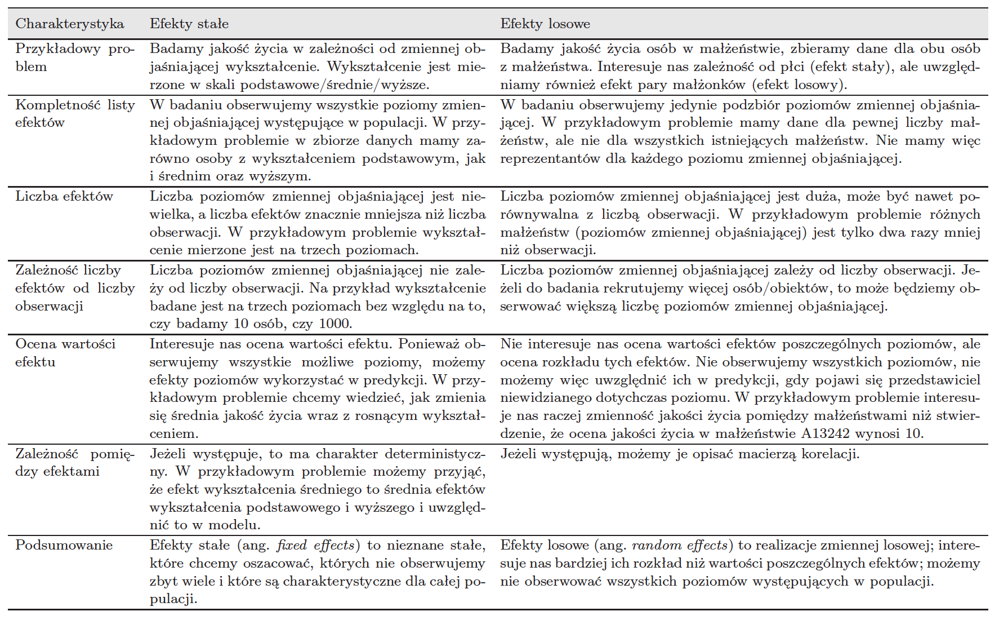

Zacznijmy od struktury modeli mieszanych (z efektami stałymi i losowymi).


# Czym różnią się efekty stałe od losowych



# Jedna składowa

Rozgrzewska: zbiór danych `milk`. 

Dziesięć krów, po cztery pomiary dla każdej. Pytanie: jaka jest średnia produkcja mleka na krowę.

```{r, warning=FALSE, message=FALSE}
library(PBImisc)
head(milk)

library(lattice)
dotplot(cow~milk.amount, data=milk, xlab="milk production [kg/day]")
```

Czy łatwo to policzyć?

```{r, warning=FALSE, message=FALSE}
(srednie = with(milk, tapply(milk.amount, cow, mean)))

summary(model2 <- lm(milk.amount~cow, data=milk))
```

Spróbujmy bardziej złożonego modelu.

```{r, warning=FALSE, message=FALSE}
library(lme4)
(model1 <- lmer(milk.amount~(1|cow), data=milk))
(model3 <- lmer(milk.amount~(1|cow), data=milk, REML=FALSE))
```

Let's compare predicted average milk production per cow.

```{r, warning=FALSE, message=FALSE}
ocenaMR = unlist(ranef(model1)) + fixef(model1)
ocenaMM = unlist(ranef(model3)) + fixef(model3)
ocenaLM = c(0,model2$coef[-1]) + model2$coef[1]
cbind(srednie, ocenaLM, ocenaMR, ocenaMM)
```

# Dwie zmienne jakościowe

Tym razem prawdziwy zbiór danych

Mamy 1000 pomiarów dla 465 krów. Krowy różnią się genotyem genu btn3a1.
Chcemy sprawdzić czy jest związek genotypu a mleczności.

```{r, warning=FALSE, message=FALSE}
summary(milkgene)
bwplot(milk~lactation, data=milkgene, ylab="milk production [kg/day]")
```

Zbudujmy model z trzema efektami.

```{r, warning=FALSE, message=FALSE}
(model1 <- lmer(milk~btn3a1+lactation+(1|cow.id), data=milkgene))
```

Wyciągamy predyktory dla efektów losowych.

```{r, warning=FALSE, message=FALSE, fig.width=7, fig.height=10}
u = ranef(model1, condVar =TRUE)
dotplot(u)
```

# Testy dla współczynników

## Test Walda

```{r, warning=FALSE, message=FALSE}
summary(model1)$coef

tse = summary(model1)$coef[2,3]
2*pnorm(tse, lower.tail=T)
```

## Test ilorazu wiarogodności

```{r, warning=FALSE, message=FALSE}
modelWithBTN1 = lmer(milk~btn3a1+lactation+(1|cow.id), data=milkgene, REML=F)
modelWithoutBTN1 = update(modelWithBTN1, . ~ . -btn3a1)

logLik(modelWithBTN1)
logLik(modelWithoutBTN1)

anova(modelWithBTN1, modelWithoutBTN1)
```

## Test permutacyjny (coś nowego)

```{r, warning=FALSE, message=FALSE}
N = 1000
logs = replicate(N, logLik(lmer(milk~sample(btn3a1)+lactation+(1|cow.id), data=milkgene, REML=FALSE)))
mean(logs > logLik(modelWithBTN1))
```

## Test ilorazu wiarogodności dla efektów losowych

```{r, warning=FALSE, message=FALSE}
(fullModel <- logLik(model1<-lmer(milk~btn3a1+lactation+(1|cow.id), data=milkgene)))
(modelWithoutCow <- logLik(model2<-lm(milk~btn3a1+lactation, data=milkgene)))
(lDelta = as.numeric(modelWithoutCow - fullModel))
pchisq(- 2 * lDelta, 1, lower.tail=FALSE)
pchisq(- 2 * lDelta, 409, lower.tail=FALSE)
```

## Test permutacyjny dla efektów losowych

```{r, warning=FALSE, message=FALSE}
milkgene2 = milkgene
N = 1000
logs = replicate(N, {
 milkgene2$cow.id = sample(milkgene2$cow.id);
 logLik(lmer(milk~btn3a1+lactation+(1|cow.id), data=milkgene2))})
mean(logs > logLik(model1))

```

