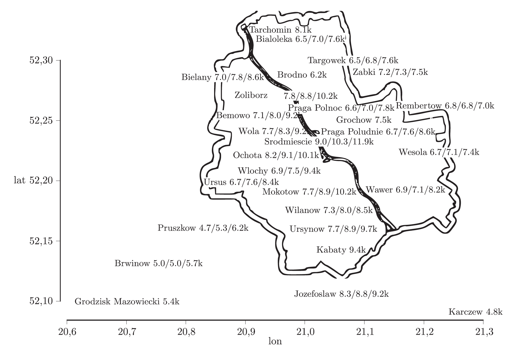

# 1. Ceny mieszkań

Będziemy pracować z cenami mieszkań pobranymi z serwisu `http://www.oferty.net/`. Zawiera ceny mieszkań z okresu 2007-2009.


```{r, message=FALSE, warning=FALSE}
library(lme4)
library(PBImisc)
library(ggplot2)

head(apartments <- na.omit(apartments[,c(1,5,9, 13,15,16)]))
```

# 2. Regresja segmentowa

Jaka jest zależność pomiędzy wiekiem apartamentu a ceną metra kwadratowego?

```{r, message=FALSE, warning=FALSE}
ggplot(apartments, aes(construction.date, m2.price)) +
  geom_point() +
  geom_smooth(se=FALSE, color="red", size=2)
```

Czy ta zależność jest zaskakująca? Dlaczego nie jest monotoniczna?

.

.

.

Jak ją modelować?

Nie wygląda jak wielomian.

.

.

.

Jednym z rozwiązań jest regresja segmentowa. Pomysł jest taki: przybliżyć zależność za pomocą łamanej - kilku prostych odcinków.

Przykładowo, załóżmy, że zależność pomiędzy rokiem budowy mieszkania a ceną.
Aby uprościć dalsze wnioskowanie załóżmy, że punktem zmiany jest rok 1990 (osobnym zagadnieniem jest jak taki punkt zmiany identyfikować).

Dodamy do modelu trzy dodatkowe parametry opisujące dwie łamane proste.

```{r, message=FALSE, warning=FALSE}
apartments$construction1990 = apartments$construction.date - 1990
apartments$olderThan1990 = apartments$construction.date > 1990

model <- lm(m2.price ~ construction1990:olderThan1990, data=apartments)

model <- lm(m2.price ~ construction1990+construction1990:olderThan1990, data=apartments)

ggplot(apartments, aes(construction1990, m2.price-7150, group=olderThan1990)) +
  geom_point() +
  geom_smooth(se=FALSE, color="red", size=2, method="lm", formula=y~x-1)
```

Pytania.

1. Jak sprawdzić czy ta zależność opisywana jest za pomocą dwóch prostych? Może wystarczy jedna a może trzy?

2. Jak znaleźć optymalny punkt podziału?

.

.

.


# 3. Dane przestrzenne

Kolejną interesującą zmienną jest dzielnica. Czy mieszkania w różnych dzielnicach mają różne ceny? Z pewnością. Ale jak to modelować?

Zobaczmy kilka możliwych podejść.

Sensownym założeniem jest, że cena zależy jakoś od odległości do centrum, im bliżej tym drożej. Sensownie też założyć, że (przy założeniu stałości innych czynników) mieszkania blisko mają podobne ceny. 



Aby zweryfikować tą hipotezę przekształćmy współrzędne geograficzne na odległość od centrum.

```{r, message=FALSE, warning=FALSE}
# This function calculates distance between two points.
# It's an approximation but quite accurate within Warsaw
getDistKm <- function(x, y) {
 sqrt(sum(((x-y)*c(100,70))^2))
}

# where is the downtown?
head(apartmentsInDownTown <- which(apartments$district == "Srodmiescie"))
(downTownCoords = apartments[apartmentsInDownTown[1],5:6])

# how far is the city centre?
# for each district, how far it is from down town
districts <- levels(apartments$district)
distances <- sapply(districts, function(x)
  getDistKm(downTownCoords, apartments[apartments$district == x, 5:6][1,]))

head(distances)
```

Zobaczmy jak wygląda rozkład ceny jako funkcja odległości od centrum.

```{r, message=FALSE, warning=FALSE}
boxplot(m2.price~district, data=apartments, at=distances, varwidth=TRUE, bty="n", las=2, xlim=c(0,16))
axis(3); mtext("Distance from Downtown [km]", line=2)

boxplot(m2.price~district, data=apartments, at=distances, varwidth=TRUE, bty="n", las=2, xlim=c(0,16), ylim=c(6000,14000))
axis(3); mtext("Distance from Downtown [km]", line=2)
```

Jak sprawdzić czy taka zależność jest istotna?

Możemy potraktować odległość jako zmienną zależną.

```{r, message=FALSE, warning=FALSE}
# add information about distances to data frame
apartments$distances = distances[apartments$district]
# add this variable to the model
summary(model2 <- update(model, .~. + distances))
```

To jedno podejście, a jakie inne opcje mamy?

.

.

.


Czy ważna jest jedynie odległość od centrum?

A może problemem jest Wisła i liczy się głównie odległość wschód-zachód?

Jak sprawdzić która odległość jest lepsza?


.

.

.


Jednym z przydatnych narzędzi może być wariogram. Pomaga on oszacować jak bliskość geograficzna koreluje z bliskością ceny.


Naturalnym estymatorem (na regularnej kracie) jest.


Jeżeli obserwacje nie są na regularnej kracie zazwyczaj stosuje się jakieś wygładzanie.

Zobaczmy dwa przykładowe wariogramy, dla odległości od centrum i dla odległości w kierunku wschód - zachód.

```{r, message=FALSE, warning=FALSE}
avg.m2.price = tapply(apartments$m2.price, apartments$district, mean) / 1000
lon <- tapply(apartments$lon, apartments$district, mean) * 70
lat <- tapply(apartments$lat, apartments$district, mean) * 100
districts.aggr = data.frame(avg.m2.price, lon, lat)
# the Variogram() function calculates a variogram
library(nlme)
plot(Variogram(districts.aggr$avg.m2.price, dist(districts.aggr$lon)),
  xlab="Distance East-West [km]", span=0.4, ylim = c(0,5))
plot(Variogram(districts.aggr$avg.m2.price, dist(districts.aggr[,2:3])),
  xlab="Distance [km]", span=0.4, ylim = c(0,5))
```

[Variograms in other packages](http://www.ats.ucla.edu/stat/r/faq/variogram.htm)

Co się dzieje dla bardzo małych i bardzo dużych odległości?

.

.

.

Wykresy są ładne dla oka, ale jak to testować?

Jednym z podejść jest test Mantela dla korelacji dwóch macierzy odległości/podobieństwa.

Jako statystyka testowa używany jest współczynnik Pearsona, a rozkład tej statystyki jest znajdowany za pomocą permutacji.


```{r, message=FALSE, warning=FALSE}
library(ade4)
distSpatial <- dist(districts.aggr[,2:3])
as.matrix(distSpatial)[1:5,1:5]

distPrice <- dist(districts.aggr$avg.m2.price)
as.matrix(distPrice)[1:5,1:5]

mantel.rtest(distSpatial, distPrice, nrepet = 9999)
```

Wszystkie metody potwierdzają, że składowa przestrzenna jest istotna.

Ale jak ją modelować?

.

Użyjemy funkcji `lme()` z pakiety `nlme`, to poprzednik `lme4`, wolniejszy ale pozawala na bogatsze modelowanie zależności pomiędzy zmiennymi.

.

Macierz odległości dodamy do modelu wprost, jako składową opisującą strukturę korelacji dla efektów losowych.

Składowa przestrzenna w elemencie epsilon.

```{r, message=FALSE, warning=FALSE}
apartments$dummy <- 1
apartments$lat <- apartments$lat + runif(length(apartments$lat),0,0.001)
apartments$lon <- apartments$lon + runif(length(apartments$lat),0,0.001)

model3 <- lme(m2.price ~ construction1990 + distances + construction1990:olderThan1990, correlation = corGaus(form = ~ lon+lat), apartments, random= ~1|dummy)

# summary
summary(model3)

# residuals
head(residuals(model3))
```

Składowa przestrzenna w komponencie losowym / z

```{r, message=FALSE, warning=FALSE}
model3 <- lme(m2.price ~ construction1990 + distances + construction1990:olderThan1990, correlation = corGaus(form = ~ lon+lat|district), apartments, random= ~1|district)

# summary
summary(model3)

# only random effects
head(random.effects(model3))
```

Inne struktury


